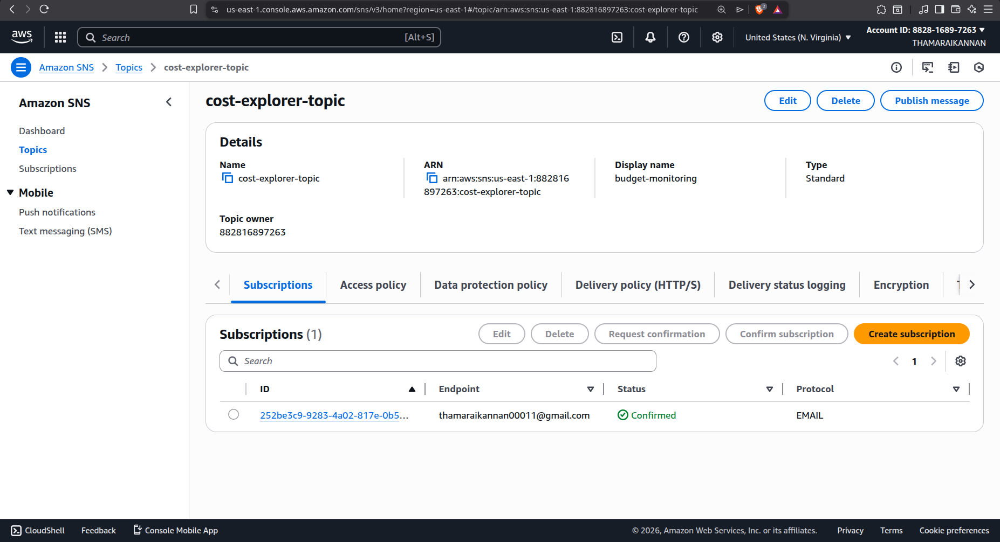
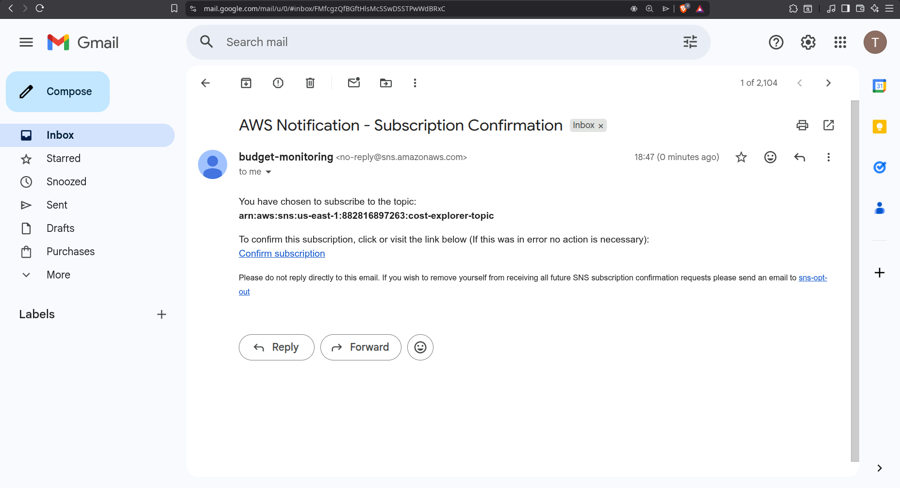
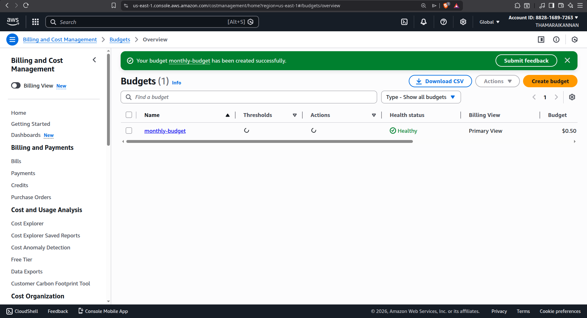
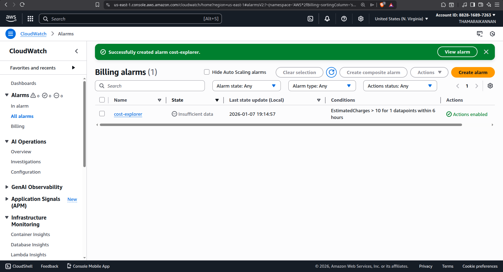
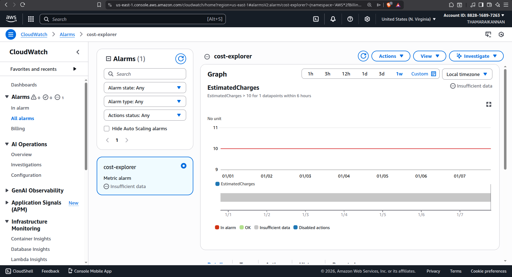

# AWS Cost Monitoring with Budgets, CloudWatch & SNS

This project demonstrates how to **monitor AWS spending and receive real-time alerts** when costs exceed defined thresholds using **AWS Budgets**, **Amazon CloudWatch Billing Alarms**, and **Amazon SNS**.

It helps prevent unexpected AWS bills by notifying users proactively via email.

---

## 📌 Architecture Overview

**Services Used**
- AWS Budgets – Monthly cost tracking and forecasting
- Amazon CloudWatch – Billing metrics and alarms
- Amazon SNS – Notification delivery (Email)
- AWS Billing & Cost Management

**Flow**
1. AWS continuously tracks account spending.
2. AWS Budgets evaluates actual and forecasted costs.
3. CloudWatch monitors total estimated charges.
4. When thresholds are crossed, alerts are sent via SNS email notifications.

---

## 🛠️ Setup Steps

### 1️⃣ Create SNS Topic & Subscription

1. Open **Amazon SNS → Topics → Create topic**
2. Choose **Standard**
3. Name: `cost-alerts-topic`
4. Create the topic

**Create Subscription**
- Protocol: `Email`
- Endpoint: *your-email@example.com*
- Confirm the subscription from your email inbox

---

### 2️⃣ Create AWS Cost Budget with SNS Alerts

1. Go to **Billing & Cost Management → Budgets → Create budget**
2. Select **Cost budget** → Monthly

**Budget Configuration**
- Name: `monthly-overall-cost`
- Period: Monthly
- Budgeting method: Fixed
- Amount: `10 USD` (adjust as required)
- Scope: All services / All accounts (or filter by tags/services)

**Alert Configuration**
- Threshold: `80%`
- Type: Percentage of budget
- Trigger: Actual cost  
- (Optional) Add forecast alert at `100%`

**Notifications**
- Email recipients
- SNS topic: `cost-alerts-topic`

Create the budget.

---

### 3️⃣ Create CloudWatch Billing Alarm

> ⚠️ Billing metrics are available only in **us-east-1 (N. Virginia)**

1. Open **CloudWatch → Alarms → Create alarm**
2. Select metric:
   - Billing → Total Estimated Charge → USD

**Metric Settings**
- Statistic: Maximum
- Period: 6 hours

**Threshold**
- Static
- Condition: Greater than `10 USD`

**Notification**
- Alarm state: `In alarm`
- SNS topic: `cost-alerts-topic`

**Alarm Name**
- `billing-over-10usd`

Create the alarm.

ℹ️ The alarm may show `INSUFFICIENT_DATA` initially until billing data is published.

---

### 4️⃣ (Optional) CloudWatch Dashboard

1. Go to **CloudWatch → Dashboards → Create dashboard**
2. Name: `cost-monitoring`

**Widgets**
- Line or Number widget:
  - Metric: Billing → Total Estimated Charge
- Alarm Status widget:
  - Alarm: `billing-over-10usd`

This provides a visual overview of AWS spending.

---

## ✅ Expected Outcome

- 📧 Email alerts when spending crosses thresholds
- 📊 Real-time visibility into AWS costs
- 🚨 Protection from unexpected AWS bills
- 💡 Better cost governance and monitoring

---

## 📚 Use Cases

- Personal AWS accounts
- Students & learners
- Startups and small teams
- Production cost monitoring
- FinOps and cost-control practices

---

## 🚀 Future Enhancements

- Add AWS Budget Actions (stop resources automatically)
- Slack notifications via SNS + Lambda
- Tag-based cost tracking
- Daily cost anomaly detection

---

## 🧑‍💻 Author

**Thamaraikannan (Cody)**  
AWS | DevOps | Cloud Enthusiast  

---

⭐ If you find this useful, don’t forget to **star the repository**!
