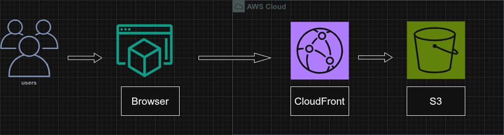
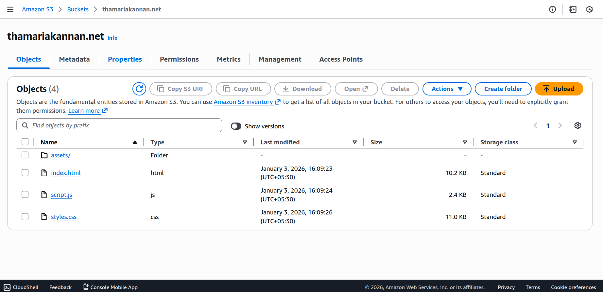
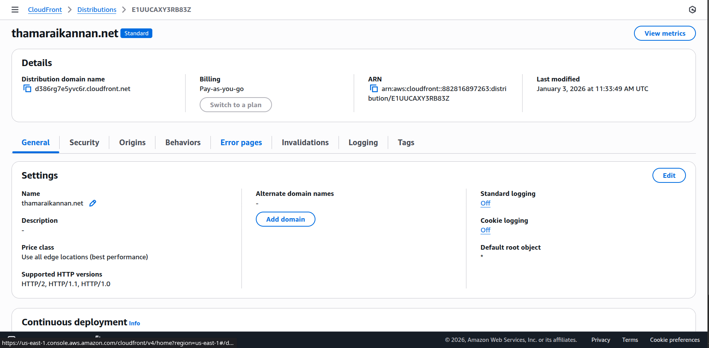
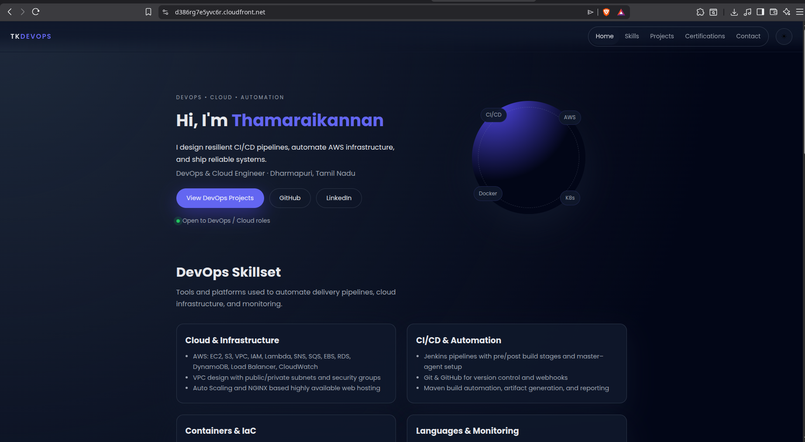

# Host a Personal Portfolio on S3 and CloudFront

This repository contains the code and infrastructure for a static personal portfolio website hosted on **Amazon S3** and delivered globally using **Amazon CloudFront** over HTTPS using the default CloudFront domain.

## Architecture

- Static files (HTML, CSS, JS, images) are stored in an S3 bucket configured as the CloudFront origin.
- CloudFront serves the content over HTTPS using the default `*.cloudfront.net` certificate.
- All user traffic goes to the CloudFront distribution URL (for example, `https://dxxxxx.cloudfront.net`), which then fetches content securely from S3.



**Amazon S3:** Stores your static portfolio files (HTML, CSS, JS, images) in a private bucket that acts as the origin for CloudFront.

**Amazon CloudFront:** CDN in front of S3 that caches content at edge locations, terminates HTTPS on the `*.cloudfront.net` domain, and improves performance and security.

These components together give you a secure, low‑latency static site, even without purchasing a custom domain.

### Request flow (end‑user perspective)

1. A user opens the CloudFront URL in a browser (for example, `https://dxxxxx.cloudfront.net`).
2. The browser connects to CloudFront over HTTPS using the default CloudFront SSL/TLS certificate.
3. CloudFront checks its edge cache:
   - If the requested object (for example, `index.html`) is cached and valid, it is returned immediately from the nearest edge location.
   - If it is not cached or has expired, CloudFront forwards the request to the S3 bucket origin you configured.

### Origin flow (CloudFront ↔ S3)

- CloudFront sends an origin request to S3 using the bucket’s REST endpoint.
- S3 reads the requested object (for example, your built portfolio assets) and returns it to CloudFront.
- CloudFront caches the object at the edge location according to the cache behavior (TTL, cache‑control headers) so future users close to that edge get faster responses.

### HTTPS behavior

- CloudFront uses the default SSL/TLS certificate for `*.cloudfront.net`, so the distribution domain is always served over HTTPS.
- You configure the viewer protocol policy to **Redirect HTTP to HTTPS**, ensuring all traffic between users and CloudFront is encrypted.

### Features

- Fast global content delivery using CDN caching.
- Fully static, low‑cost, and highly available hosting.
- Secure HTTPS access via the CloudFront distribution domain.

## Hands On

### Step 1: Create S3 bucket and upload site

1. In the AWS console, search for **S3** and open **S3**.
2. Click **Create bucket**.
3. Enter a globally unique **Bucket name** (for example, `my-portfolio-site`).
4. Leave **Object Ownership** as default and **Block Public Access** **ON** (CloudFront will be the only public entry point).
5. Click **Create bucket**.
6. Click the new bucket → **Upload** → add your built static files (`index.html`, CSS, JS, images) → **Upload**.



### Step 2: Create CloudFront distribution

1. In the AWS console, search for **CloudFront** and open **CloudFront**.
2. On the **Distributions** page, click **Create distribution**.

#### 2.1 Specify origin

3. Under **Origin type**, select **Amazon S3**.
4. In **S3 origin**, choose your bucket endpoint from the dropdown  
   (for example, `thamarikannan.net.s3.us-east-1.amazonaws.com`).
5. Leave **Origin path** empty.
6. In **Settings**:
   - Keep **Allow private S3 bucket access to CloudFront – Recommended** checked.  
     This lets CloudFront update the bucket policy so only CloudFront can read the bucket.
   - Keep **Use recommended origin settings** selected.
   - Keep **Use recommended cache settings tailored to serving S3 content** selected.
7. Click **Next**.

#### 2.2 Enable security and defaults

8. In the **Security / Default behavior** step:
   - For **Viewer protocol policy**, choose **Redirect HTTP to HTTPS**.
   - Leave other options at their defaults for a simple static site.
9. In the **Settings** section:
   - Leave **Default CloudFront certificate (*.cloudfront.net)** selected  
     (no custom domain; you will use the CloudFront URL).

10. Continue through the wizard until **Review and create**, then click **Create distribution**.

#### 2.3 Access the site

11. After the distribution status becomes **Deployed**, copy the **Domain name** value  
    (for example, `dxxxxxxxxxxxx.cloudfront.net`).
12. Open a browser and visit `https://d386rg7e5yvc6r.cloudfront.net/` to see your portfolio served from S3 via CloudFront.



### Result



``` 
If access denied while accessing website edit the Default root object to "*" or "index.html" 
``` 


> 💡 If you still see `AccessDenied`, try opening `https://dxxxxxxxxxxxx.cloudfront.net/index.html`. 
> If that works but the root URL does not, double‑check that the default root object is exactly `index.html` (same spelling as in the bucket).