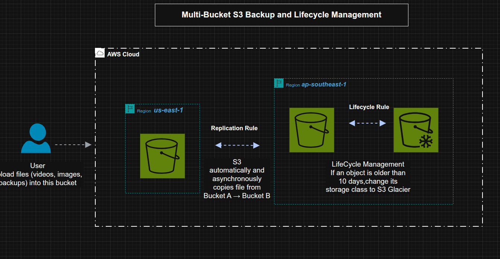
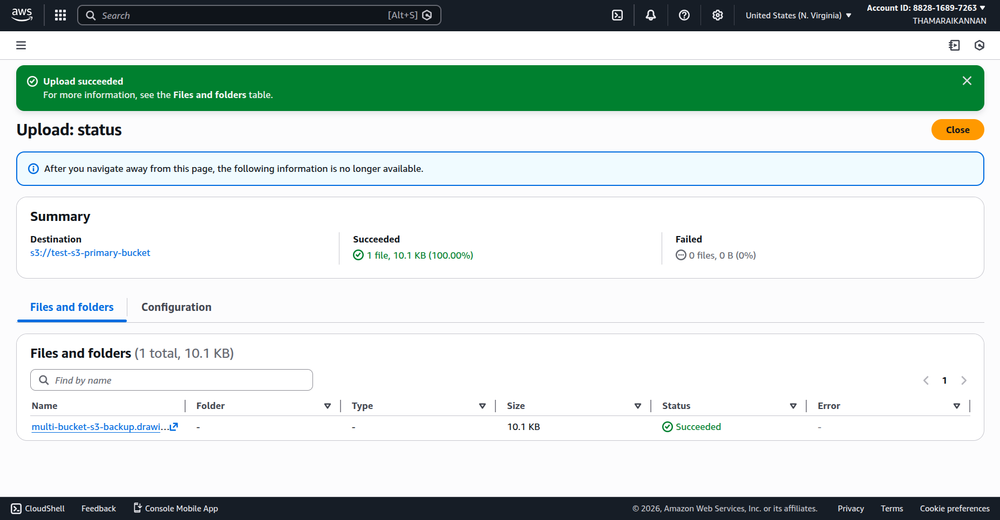
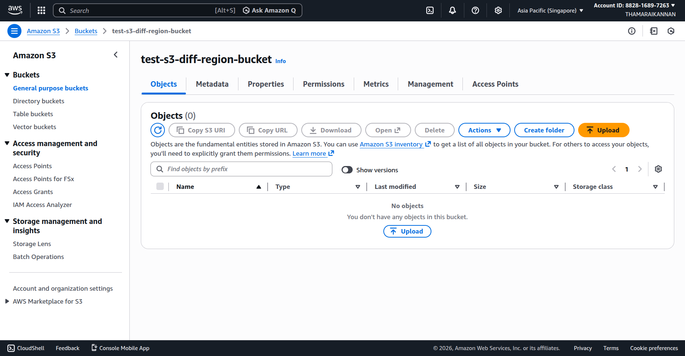
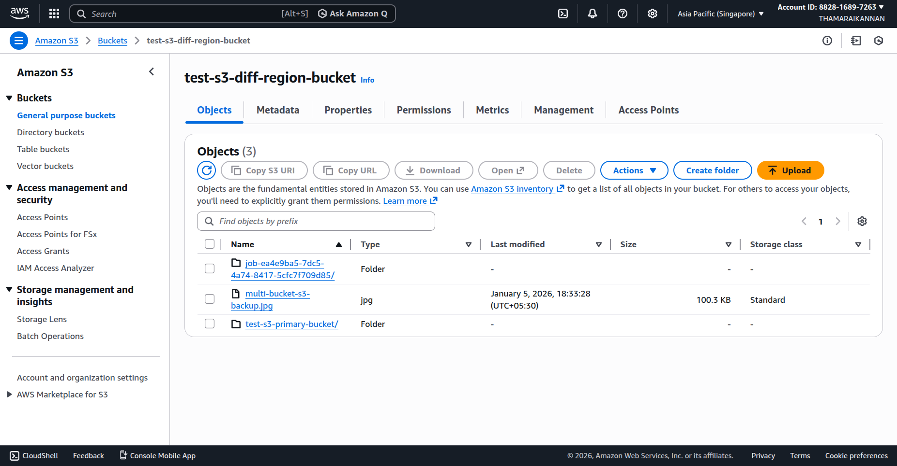
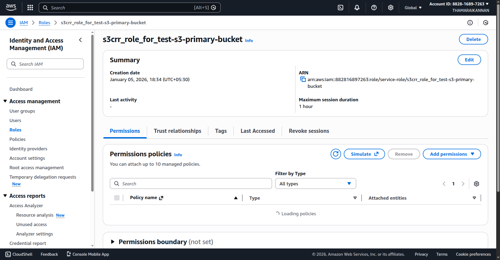
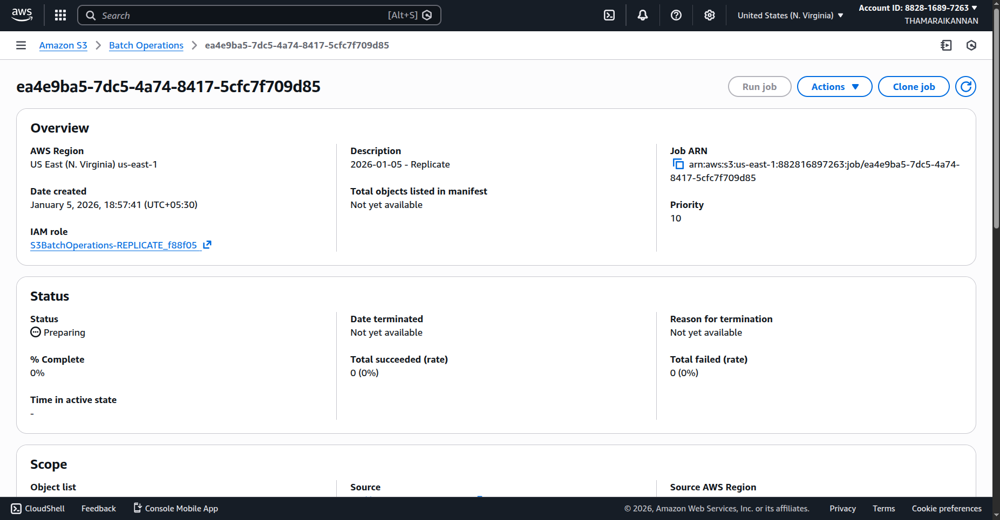
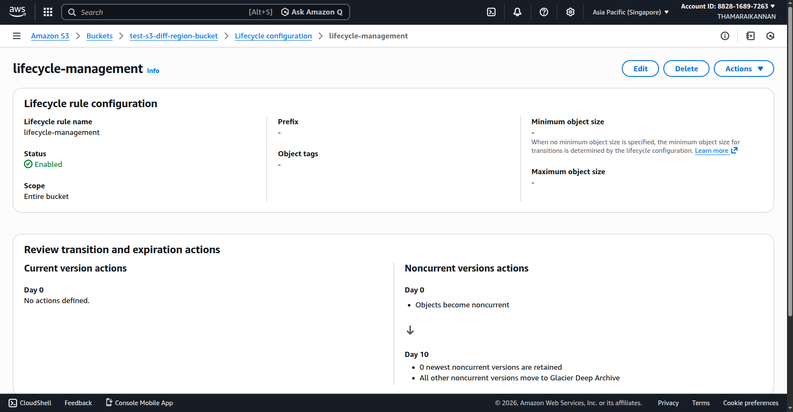

# Multi-Bucket S3 Backup and Lifecycle Management

This project demonstrates a **real-world, hands-on implementation of a multi-bucket, cross-Region backup and disaster recovery (DR) solution using Amazon S3**.

The goal of this setup is to ensure **high data durability, regional fault tolerance, and long-term cost optimization** by using native AWS services. It reflects how organizations design backup and DR solutions for production workloads.

The solution leverages:
- Amazon S3 for durable object storage
- S3 Cross-Region Replication (CRR) for disaster recovery
- S3 Lifecycle policies for automated archival
- IAM service roles for secure replication
- S3 Batch Operations for replicating existing objects

This lab is suitable for **cloud, DevOps, and AWS learners** who want practical experience with backup and DR architectures.

## 1. Architecture Overview



### Architecture Explanation

This architecture is designed to protect data from **Region-level failures, accidental deletions, and overwrites**, while also minimizing storage costs for historical data.

The solution uses **two Amazon S3 buckets deployed in different AWS Regions**:

- A **Primary bucket** that stores active and frequently accessed objects.
- A **Disaster Recovery (DR) bucket** in another Region that maintains a replicated copy of the data.

When a user uploads an object to the primary bucket, **S3 Cross-Region Replication (CRR)** automatically and asynchronously replicates that object to the DR bucket. This ensures that a near real-time copy of the data exists outside the primary Region.

To control storage cost, the DR bucket is configured with an **S3 Lifecycle rule**. When objects are updated or deleted, older versions become **noncurrent versions**. After 10 days, these noncurrent versions are transitioned to **S3 Glacier Deep Archive**, which provides extremely low-cost storage for long-term retention.

This combination delivers both **disaster recovery protection** and **cost-efficient archival** without manual intervention.

### Why This Architecture?

- **High durability:** Data is stored across multiple AWS Regions
- **Disaster recovery readiness:** Protects against Region-wide outages
- **Cost optimization:** Older versions are automatically archived
- **Fully automated:** No manual backup or cleanup required

### Regions Used

- **Primary Region:** us-east-1 (N. Virginia)
- **DR Region:** ap-southeast-1 (Singapore)

### Buckets

| Purpose | Bucket Name | Region |
|------|-----------|--------|
| Primary bucket | `test-s3-primary-bucket` | us-east-1 |
| DR bucket | `test-s3-diff-region-bucket` | ap-southeast-1 |

### Data Flow

1. Users upload objects (images, videos, backups) to the **primary S3 bucket**.
2. S3 Cross-Region Replication copies objects to the **DR bucket** asynchronously.
3. Updates or deletions create **noncurrent versions** in the DR bucket.
4. After 10 days, lifecycle rules move noncurrent versions to **S3 Glacier Deep Archive**.

---

## Hands on

---

## Step 1: Create the Primary S3 Bucket

1. Open **Amazon S3 Console**
2. Click **Create bucket**
3. Enter:

   * Bucket name: `test-s3-primary-bucket`
   * Region: **us‑east‑1**
4. Enable **Bucket Versioning**
5. Leave other settings default
6. Click **Create bucket**



---

## Step 2: Create the DR S3 Bucket

1. Click **Create bucket**
2. Enter:

   * Bucket name: `test-s3-diff-region-bucket`
   * Region: **ap‑southeast‑1**
3. Enable **Bucket Versioning**
4. Click **Create bucket**



---

## Step 3: Configure Cross‑Region Replication (CRR)

### 3.1 Enable Replication Rule

1. Open **Primary bucket** → **Management** tab
2. Click **Create replication rule**
3. Rule name: `crr-primary-to-dr`

### 3.2 Replication Rule Settings

* **Source bucket:** `test-s3-primary-bucket`
* **Scope:** Entire bucket
* **Destination bucket:** `test-s3-diff-region-bucket`
* **Destination region:** ap‑southeast‑1
* **Storage class:** STANDARD
* **Replica ownership:** Same account
* **RTC:** Disabled (best‑effort replication)

### 3.3 Replicate Existing Objects

When prompted:

* Select **Yes, replicate existing objects**
* This triggers **S3 Batch Replication**

Click **Save**



---

## Step 4: IAM Role for Replication

When saving the rule, AWS automatically creates an IAM role similar to:

```
s3crr_role_for_test-s3-primary-bucket
```

### Permissions Include

* `s3:GetObject`
* `s3:GetObjectVersion`
* `s3:ReplicateObject`
* `s3:ReplicateDelete`
* `s3:ReplicateTags`

### Trust Policy

Allows:

```
Service: s3.amazonaws.com
```



> 🔐 This role allows S3 to replicate objects on your behalf

---

## Step 5: S3 Batch Replication for Existing Objects

### 5.1 Batch Job Creation

1. Go to **S3 → Batch Operations**
2. View the auto‑created job

### Job Details

* Job type: **Replicate objects**
* Source region: us‑east‑1
* Destination bucket: `test-s3-diff-region-bucket`
* IAM role: `S3BatchOperations-REPLICATE-*`

### 5.2 Monitor Job Status

Status progression:

```
Preparing → Active → Complete
```

Metrics shown:

* Total objects
* Successful replications
* Failed objects




---

## Step 6: Verify Replication in DR Bucket

Open `test-s3-diff-region-bucket`

You should see:

* `test-s3-primary-bucket/` folder
* Replicated objects
* Batch job folder (`job-*`)

This confirms:

* Cross‑Region Replication is working
* Existing objects are replicated


---

## Step 7: Configure Lifecycle Rule in DR Bucket

### 7.1 Create Lifecycle Rule

1. Open **DR bucket** → **Management** tab
2. Click **Create lifecycle rule**
3. Rule name: `lifecycle-management`

### 7.2 Rule Scope

* Apply to **entire bucket**

### 7.3 Lifecycle Actions

#### Current Versions

* No transition (remain STANDARD)

#### Noncurrent Versions

* Day 0: Eligible for lifecycle
* Day 10: Transition to **S3 Glacier Deep Archive**

Save the rule



---

## 9. End‑to‑End Workflow

1. Upload file to **primary bucket**
2. File is automatically replicated to **DR bucket**
3. File update/delete creates **noncurrent versions**
4. After 10 days, noncurrent versions move to **Glacier Deep Archive**

---

## 10. Outcome and Benefits

✅ Near real‑time cross‑Region DR copy
✅ One‑time replication of existing objects
✅ Automated archival using Glacier Deep Archive
✅ Reduced long‑term storage cost
✅ Improved data durability and compliance

---

## 11. Cleanup (Optional)

To avoid charges:

* Delete lifecycle rules
* Disable replication
* Delete S3 buckets
* Delete IAM roles created for replication

---
**Use Case:** Backup, Disaster Recovery, Cost Optimization

