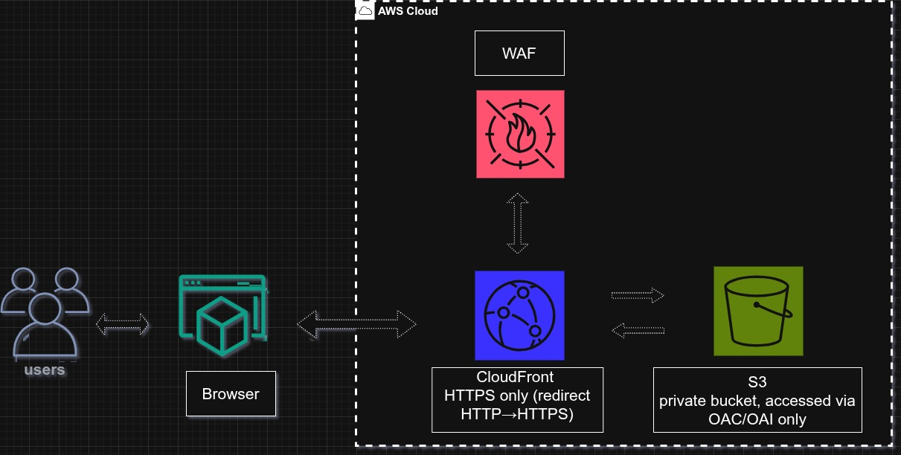
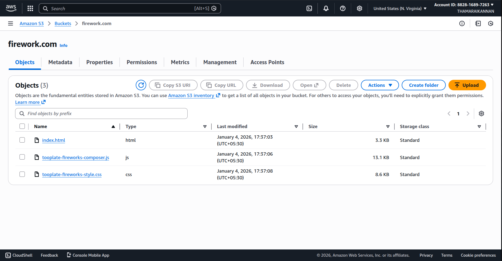
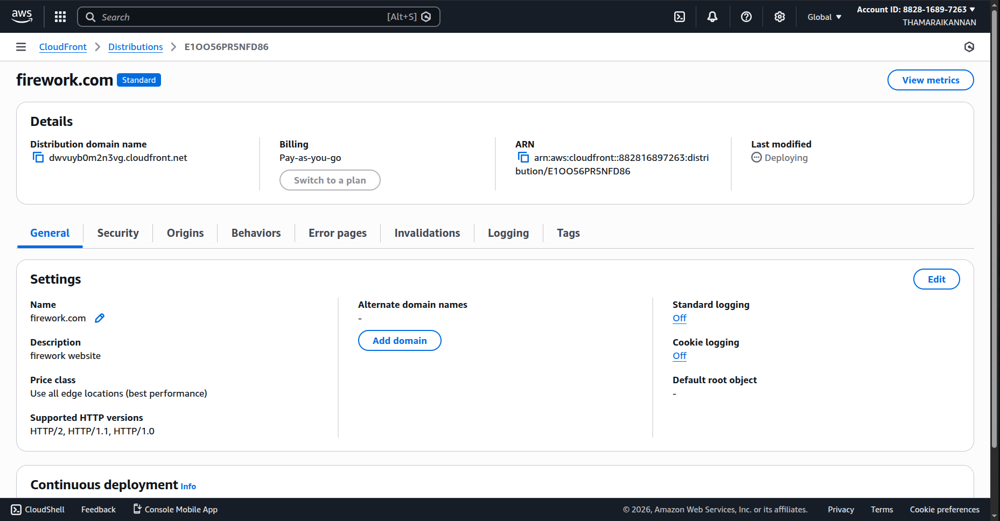
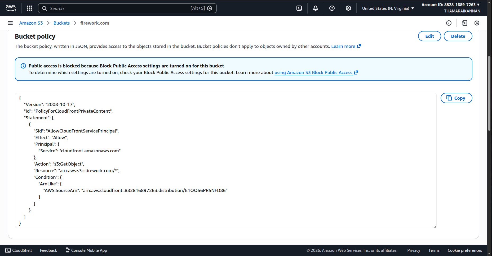
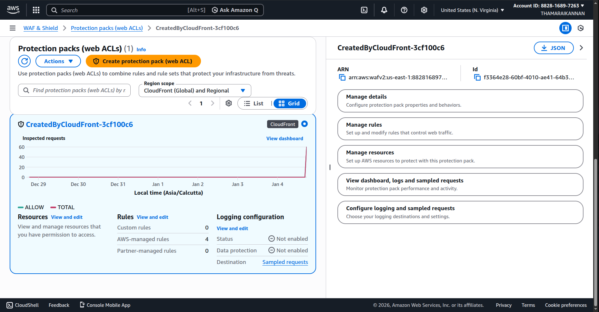
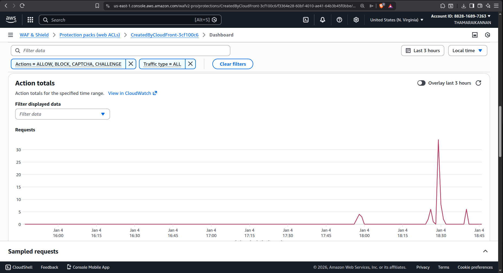
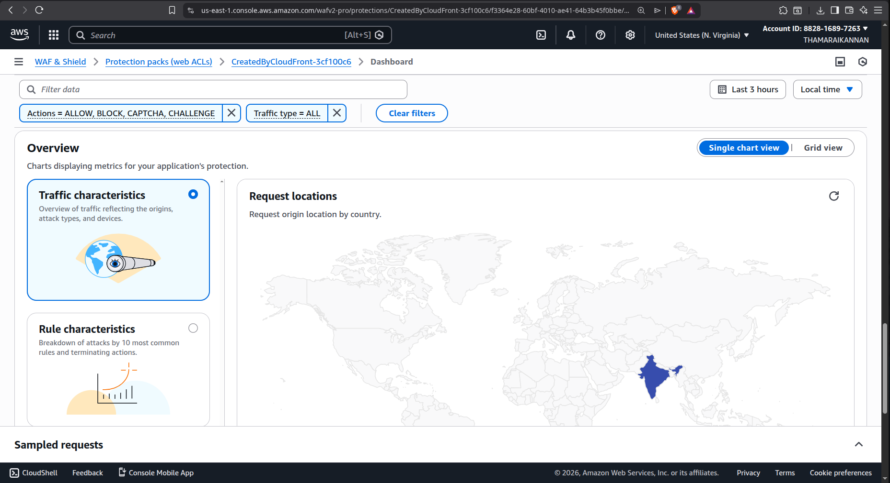
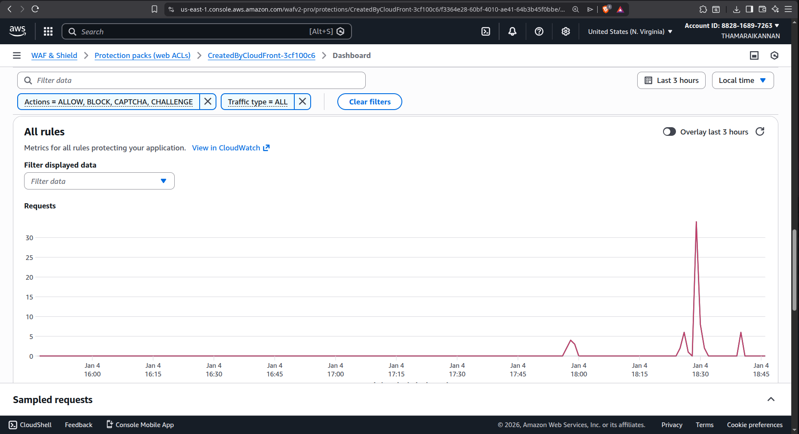
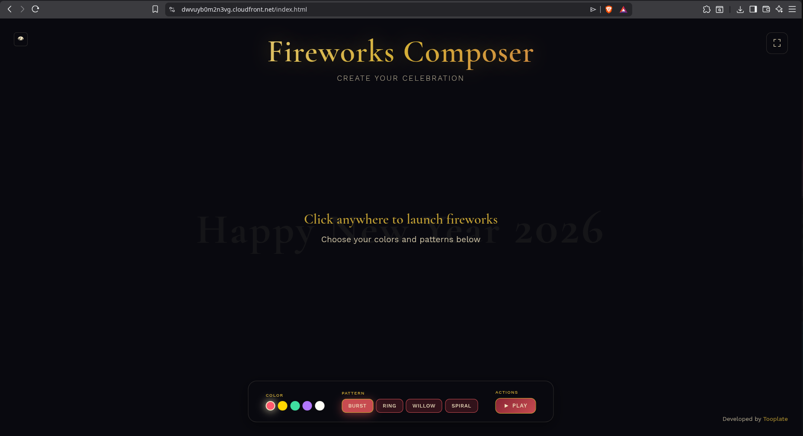

# Secure Static Website with S3 and WAF

        A secure static website on AWS typically uses S3 as the origin, CloudFront as the CDN entry point, AWS WAF for layer‑7 protection, and ACM for HTTPS certificates on the CloudFront distribution. This setup ensures users only access content over HTTPS via CloudFront, while direct public access to S3 is blocked and inspected traffic is filtered by WAF rules.

## Overview

This architecture combines:

- **Amazon S3** (private origin) – Stores static content
- **Amazon CloudFront** (CDN + HTTPS entry point) – Global content delivery with caching
- **AWS WAF** (Layer-7 protection) – DDoS and application layer protection

The site is accessible via `https://<distribution-id>.cloudfront.net` with automatic HTTP-to-HTTPS redirection.

---

## Architecture



### Components

**Users / Browser**

End-users access the website via `https://<distribution-id>.cloudfront.net` with full HTTPS encryption. HTTP traffic is automatically redirected to HTTPS.

**Amazon CloudFront**

A global CDN that:
- Terminates HTTPS at edge locations worldwide
- Caches static content (HTML, CSS, JS, images)
- Enforces HTTP-to-HTTPS redirection
- Uses Origin Access Control (OAC) or Origin Access Identity (OAI) to securely fetch content from S3
- Provides a default CloudFront SSL certificate (*.cloudfront.net)

**Amazon S3 (Static Content Origin)**

Stores all static assets including index.html, CSS, JavaScript, and images with:
- **Block public access** enabled
- Bucket policy restricting `s3:GetObject` to the CloudFront distribution only
- CloudFront REST endpoint (not S3 website hosting endpoint)

**AWS WAF**

A Web ACL scoped to CloudFront (Global) that:
- Attaches directly to the CloudFront distribution
- Applies AWS managed rule groups (Common, SQLi, XSS, bot protections)
- Supports optional custom rules (rate limiting, IP allow/deny, geo-blocking)

### Request Flow

1. User opens `https://<distribution-id>.cloudfront.net`
2. Browser connects to CloudFront over HTTPS using the default CloudFront certificate
3. CloudFront invokes the associated WAF web ACL, evaluating the request against managed and custom rules
4. Malicious requests are blocked with a 403 response
5. Allowed requests are forwarded from CloudFront to the private S3 bucket using OAC/OAI-signed requests
6. S3 returns the object to CloudFront
7. CloudFront caches the response and returns it to the browser over HTTPS

---

## Workflow Overview

1. Prepare S3 bucket for static hosting (private)
2. Deploy the CloudFront distribution with S3 as origin, OAC/OAI for private access, and HTTPS-only for viewers
3. Lock S3 so only CloudFront can read objects
4. Configure AWS WAF Web ACL and associate it with the distribution
5. Test direct S3 access (should be denied) and CloudFront access (should load the site)

---

## Hands-On Guide

### Prerequisites

- AWS account with access to S3, CloudFront and WAF
- Built static content (React/Vue/Angular build or plain HTML/CSS/JS)

### Step 1: Create and Upload to S3 Bucket

1. Open the AWS console → **S3** → **Create bucket**
2. Configure the bucket:
   - **Bucket name**: e.g., `firework.com` or `my-static-site-demo`
   - **Block Public Access**: Keep all options enabled
3. Click **Create bucket**
4. Open the bucket → **Objects** → **Upload**:
   - Upload `index.html`, CSS, JavaScript, images, etc.
   - Keep all object permissions private (default)
   - **Do not enable "Static website hosting"** and **do not make the bucket public**



### Step 2: Create CloudFront Distribution

1. Go to **CloudFront** → **Distributions** → **Create distribution**
2. Choose **Single website or app**
3. Specify origin:
   - **Origin type**: S3
   - **Origin domain**: Select the S3 bucket (non-website endpoint)
   - **Origin path**: Leave empty (unless your site lives under a folder)
4. Configure origin access:
   - Choose **Origin access control** (recommended)
   - If prompted, create a new OAC with:
     - Origin type: S3
     - Sign requests: Enabled
5. Configure default cache behavior:
   - **Viewer protocol policy**: Redirect HTTP to HTTPS
   - **Allowed HTTP methods**: GET, HEAD (and optionally OPTIONS)
8. Click **Create distribution** and wait until status becomes **Deployed**



### Step 3: Lock S3 to CloudFront Only

1. In **CloudFront** → **Distributions** → **firework.com** → **Origins**:
   - Confirm the origin uses the OAC (or OAI)
   - If available, copy the bucket policy and ensure it's applied to S3
2. In **S3** → your bucket → **Permissions** → **Bucket policy**, confirm the policy includes:

```json
{
  "Version": "2008-10-17",
  "Id": "PolicyForCloudFrontPrivateContent",
  "Statement": [
    {
      "Sid": "AllowCloudFrontServicePrincipal",
      "Effect": "Allow",
      "Principal": {
        "Service": "cloudfront.amazonaws.com"
      },
      "Action": "s3:GetObject",
      "Resource": "arn:aws:s3:::firework.com/*",
      "Condition": {
        "StringEquals": {
          "AWS:SourceArn": "arn:aws:cloudfront::1234xxxxxx:distribution/firework.com"
        }
      }
    }
  ]
}
```



3. Ensure **Block public access** remains **ON**

### Step 4: Test Basic Access

**Direct S3 test:**
- Try `https://YOUR_BUCKET_NAME.s3.YOUR-REGION.amazonaws.com/index.html`
- Expected result: **AccessDenied** (XML error) ✓

**CloudFront test:**
- Open `https://YOUR_DISTRIBUTION_ID.cloudfront.net/`
- Expected result: Site loads ✓
- Try `http://YOUR_DISTRIBUTION_ID.cloudfront.net/` and confirm it redirects to HTTPS ✓

### Step 5: Configure AWS WAF Web ACL (If Not Auto-Created)

If CloudFront already created a `CreatedByCloudFront-xxxxx` web ACL and associated it with the distribution, skip to Step 6.

Otherwise:

1. Go to **AWS WAF & Shield** → **Web ACLs** → **Create web ACL**
2. Configure:
   - **Name**: `static-site-cloudfront-waf`
   - **Scope**: CloudFront
   - **Resources**: Choose your CloudFront distribution
3. Add rules by adding AWS managed rule groups:
   - `AWSManagedRulesAntiDDoS`
   - `AWSManagedRulesIpReplication`
   - `AWSManagedRulesKnownBadInputsRuleSet`
   - (Optional) BotControl, IP reputation, etc.
4. Set **Default action**: Allow
5. Click **Create web ACL**



### Step 6: Verify WAF

1. In the web ACL, confirm your distribution is listed under **Resources**
2. Open your site via CloudFront a few times and check **Requests** graphs in WAF for inspected traffic
3. (Optional) Add a rate-based rule limiting requests per IP
4. (Optional) Add an IP set with blocked IPs
5. (Optional) Enable logging:
   - In the web ACL, configure logging to an S3 bucket or CloudWatch Logs to inspect detailed requests







---

## Final Result



After completing this project:

✅ Your static site is served via CloudFront over HTTPS, even without an ACM certificate, using the default *.cloudfront.net certificate

✅ The S3 bucket is private, accessible only to CloudFront via OAC/OAI; direct public access is blocked

✅ AWS WAF protects the site at the edge, inspecting all traffic and blocking common web exploits and abusive behavior

✅ You have a clear path to add a custom domain and ACM certificate later without redesigning the architecture