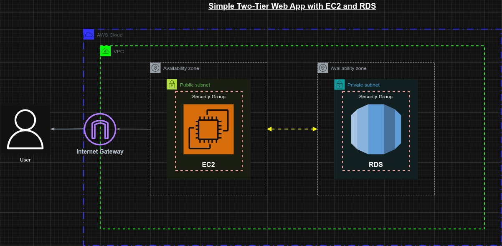
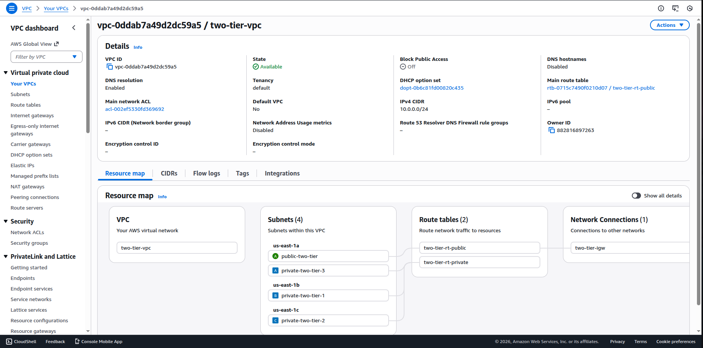
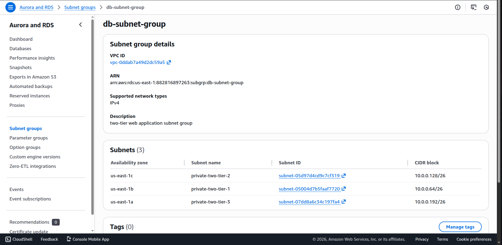
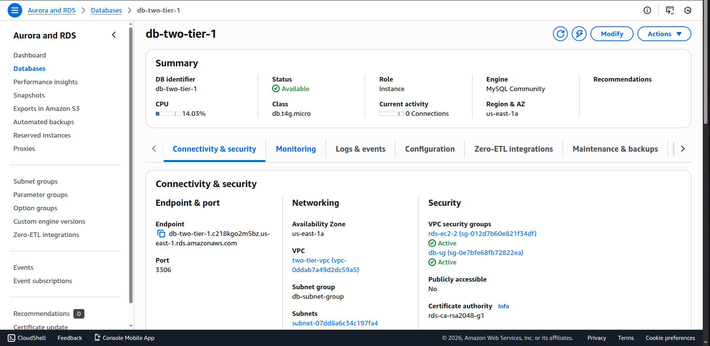
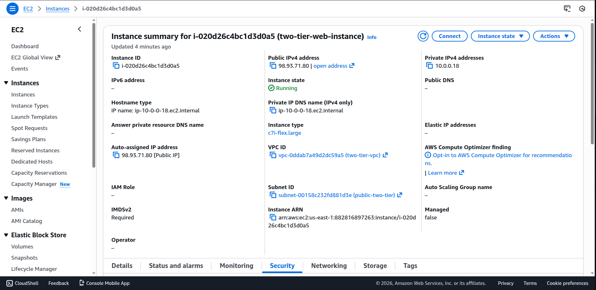
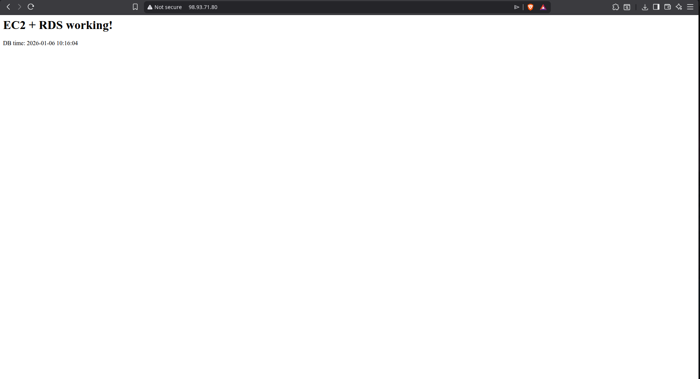

# Simple Two-Tier Web Application with EC2 and RDS

## Overview

This project demonstrates a production-grade, two-tier application architecture on Amazon Web Services (AWS). It showcases best practices for separating concerns between a web tier and a database tier, ensuring security, scalability, and maintainability.

The application deploys a simple PHP-based web server that connects to a managed MySQL database, illustrating how modern applications isolate public-facing components from sensitive data resources.

### What You'll Learn

- How to design and implement a secure VPC with public and private subnets
- Deployment of EC2 instances with Nginx and PHP 8.3
- Management of AWS RDS for database hosting
- Security group configuration for inter-tier communication
- Best practices for network isolation and access control

---

## Architecture Overview



### System Design

The two-tier architecture consists of:

**Web Tier (Public)**
- Ubuntu EC2 instance running in a public subnet
- Nginx web server with PHP-FPM 8.3
- Accessible from the internet via an Elastic IP
- Serves HTTP requests and processes PHP logic
- Acts as the intermediary between end users and the database

**Database Tier (Private)**
- Amazon RDS MySQL instance isolated in private subnets
- Not directly accessible from the internet
- Accepts connections only from the web tier via security groups
- Provides persistent, managed data storage
- Spans multiple Availability Zones for high availability

### Network Topology

**VPC Configuration (10.0.0.0/24)**

- **Internet Gateway (IGW)**
  - Provides connectivity between VPC and the internet
  - Attached to `two-tier-vpc`
  - Routes traffic from public subnet to the internet

- **Public Subnet (10.0.0.0/26)**
  - AZ: us-east-1a
  - Contains EC2 instance running Nginx + PHP
  - Route Table: `two-tier-rt-public` (0.0.0.0/0 → IGW)
  - Security Group: `Web-SG` (allows HTTP 80, SSH 22)
  - Elastic IP associated with EC2 for static public access

- **Private Subnet-A (10.0.0.64/26)**
  - AZ: us-east-1b
  - Part of RDS DB Subnet Group
  - Route Table: `two-tier-rt-private` (local routes only, no IGW)
  - Security Group: `DB-SG` (allows MySQL 3306 from Web-SG)
  - Hosts RDS MySQL Primary/Replica instance

- **Private Subnet-B (10.0.0.128/26)**
  - AZ: us-east-1c
  - Part of RDS DB Subnet Group
  - Route Table: `two-tier-rt-private` (local routes only, no IGW)
  - Security Group: `DB-SG` (allows MySQL 3306 from Web-SG)
  - Hosts RDS MySQL Replica instance

- **Private Subnet-C (10.0.0.192/26)**
  - AZ: us-east-1d
  - Part of RDS DB Subnet Group
  - Route Table: `two-tier-rt-private` (local routes only, no IGW)
  - Security Group: `DB-SG` (allows MySQL 3306 from Web-SG)
  - Hosts RDS MySQL Replica instance

- **Data Flow**
  - Public → Internet: EC2 outbound traffic → IGW → Internet
  - Internet → Public: Incoming HTTP requests → IGW → EC2
  - Web Tier → Database Tier: EC2 → Private IP (3306) → RDS (via security group reference)
  - Database Tier ↛ Internet: No direct route to IGW (isolated)

### Key Features

- **Network Isolation**: Web tier in public subnet, database in private subnets
- **Security Groups**: Layered access control with Web-SG and DB-SG
- **High Availability**: RDS spans 3 Availability Zones (requirement: minimum 2)
- **Elastic IP**: Static public IP for consistent EC2 access
- **Managed Database**: AWS RDS handles backups, patches, and maintenance
- **Minimal Setup**: No load balancers or auto-scaling (easily extensible)

---

## Prerequisites

Before starting, ensure you have:

- **AWS Account** with appropriate permissions (VPC, EC2, RDS, Security Groups)
- **Key Pair** for SSH access to EC2 instances
- **Local SSH Client** (ssh command on Linux/Mac, or PuTTY on Windows)
- **MySQL Client** (optional, for local database testing)
- **Basic Knowledge** of Linux, Nginx, PHP, and MySQL
- **Region Selection** (examples use us-east-1; adjust as needed)

---

## Step-by-Step Deployment

### Step 1: Create VPC and Networking Infrastructure

#### 1.1 Create the VPC

1. Navigate to **VPC Dashboard** in AWS Console
2. Click **Create VPC**
   - **Name**: `two-tier-vpc`
   - **CIDR Block**: `10.0.0.0/24`
3. Click **Create VPC**

#### 1.2 Create Subnets

Create one public subnet and three private subnets:

**Public Subnet**
1. In VPC Dashboard, go to **Subnets**
2. Click **Create Subnet**
   - **VPC**: `two-tier-vpc`
   - **Name**: `public-two-tier`
   - **Availability Zone**: `us-east-1a`
   - **CIDR Block**: `10.0.0.0/26`
3. Click **Create Subnet**

**Private Subnets** (repeat 3 times)

First Private Subnet:
- **VPC**: `two-tier-vpc`
- **Name**: `private-two-tier-a`
- **Availability Zone**: `us-east-1b`
- **CIDR Block**: `10.0.0.64/26`

Second Private Subnet:
- **VPC**: `two-tier-vpc`
- **Name**: `private-two-tier-b`
- **Availability Zone**: `us-east-1c`
- **CIDR Block**: `10.0.0.128/26`

Third Private Subnet:
- **VPC**: `two-tier-vpc`
- **Name**: `private-two-tier-c`
- **Availability Zone**: `us-east-1d`
- **CIDR Block**: `10.0.0.192/26`

#### 1.3 Create Internet Gateway

1. Go to **Internet Gateways** in VPC Dashboard
2. Click **Create Internet Gateway**
   - **Name**: `two-tier-igw`
3. Select the created IGW and click **Attach to VPC**
4. Select `two-tier-vpc` and confirm

#### 1.4 Create and Configure Route Tables

**Public Route Table**
1. Go to **Route Tables**
2. Click **Create Route Table**
   - **Name**: `two-tier-rt-public`
   - **VPC**: `two-tier-vpc`
3. Select the route table, go to **Routes** tab
4. Click **Edit Routes**, then **Add Route**
   - **Destination**: `0.0.0.0/0`
   - **Target**: Select Internet Gateway → `two-tier-igw`
5. Go to **Subnet Associations** tab
6. Click **Edit Subnet Associations** and select `public-two-tier`
7. Save

**Private Route Table**
1. Click **Create Route Table**
   - **Name**: `two-tier-rt-private`
   - **VPC**: `two-tier-vpc`
2. Go to **Subnet Associations** tab
3. Click **Edit Subnet Associations** and select all three private subnets
4. Save (no additional routes needed—only local traffic is allowed)



---

### Step 2: Configure Security Groups

#### 2.1 Create Web Security Group

1. Go to **Security Groups** in EC2 Dashboard
2. Click **Create Security Group**
   - **Name**: `Web-SG`
   - **Description**: `Security group for web tier`
   - **VPC**: `two-tier-vpc`

3. Configure inbound rules:
   - **HTTP**: Type = HTTP, Protocol = TCP, Port = 80, Source = `0.0.0.0/0`
   - **SSH**: Type = SSH, Protocol = TCP, Port = 22, Source = `YOUR-IP-ADDRESS/32` (your public IP)

4. Outbound rules: Allow all (default)
5. Click **Create Security Group**

#### 2.2 Create Database Security Group

1. Click **Create Security Group**
   - **Name**: `DB-SG`
   - **Description**: `Security group for database tier`
   - **VPC**: `two-tier-vpc`

2. Configure inbound rules:
   - **MySQL/Aurora**: Type = MySQL/Aurora, Protocol = TCP, Port = 3306, Source = `Web-SG` (select the Web-SG security group)

3. Outbound rules: Allow all (default)
4. Click **Create Security Group**

---

### Step 3: Create RDS Database

#### 3.1 Create DB Subnet Group

1. Go to **RDS Dashboard** → **Subnet Groups**
2. Click **Create DB Subnet Group**
   - **Name**: `db-subnet-group`
   - **Description**: `Subnet group for two-tier app`
   - **VPC**: `two-tier-vpc`
   - **Subnets**: Select `private-two-tier-a`, `private-two-tier-b`, `private-two-tier-c`
3. Click **Create**



#### 3.2 Create RDS MySQL Instance

1. Go to **Databases** and click **Create Database**
2. Configuration:
   - **Engine**: MySQL (latest version)
   - **Templates**: Free Tier (if available)
   - **DB Instance Identifier**: `db-two-tier-1`
   - **Master Username**: `admin`
   - **Master Password**: `admin#123` (use a strong password in production)
   - **DB Instance Class**: `db.t3.micro` (free tier)
3. **Connectivity**:
   - **VPC**: `two-tier-vpc`
   - **DB Subnet Group**: `db-subnet-group`
   - **Public Accessibility**: `No`
   - **VPC Security Groups**: `DB-SG`
4. **Backup and Maintenance**: Accept defaults
5. Click **Create Database** and wait for creation (5-10 minutes)



#### 3.3 Initialize Database

Once RDS is available, note the **endpoint** (e.g., `db-two-tier-1.cxxxxx.us-east-1.rds.amazonaws.com`).

From your local machine or EC2 instance (after it's created), run:

```bash
mysql -h db-two-tier-1.cxxxxx.us-east-1.rds.amazonaws.com -u admin -p
# Enter password: admin#123
```

Then execute:

```sql
CREATE DATABASE `two-tier`;
USE `two-tier`;

CREATE TABLE test (
  id INT PRIMARY KEY AUTO_INCREMENT,
  msg VARCHAR(100)
);

INSERT INTO test (msg) VALUES ('Hello from RDS');

EXIT;
```

---

### Step 4: Launch EC2 Web Server



#### 4.1 Create EC2 Instance

1. Go to **EC2 Dashboard** → **Instances**
2. Click **Launch Instances**
3. Configuration:
   - **Name**: `web-two-tier`
   - **AMI**: Ubuntu 22.04 LTS (or latest)
   - **Instance Type**: `t2.micro` (free tier)
   - **Key Pair**: Select your SSH key
4. **Network Settings**:
   - **VPC**: `two-tier-vpc`
   - **Subnet**: `public-two-tier`
   - **Auto-assign Public IP**: Enable
   - **Security Group**: `Web-SG`
5. **Storage**: Default (20 GB)
6. Click **Launch Instance** and wait for it to start


#### 4.2 Allocate Elastic IP (Optional)

1. Go to **Elastic IPs** in EC2 Dashboard
2. Click **Allocate Elastic IP Address**
3. Select the created IP, then **Associate Elastic IP Address**
4. Select your instance and wait for association

---

### Step 5: Configure Nginx and PHP on EC2

#### 5.1 SSH into the Instance

```bash
ssh -i /path/to/key.pem ubuntu@YOUR-EC2-PUBLIC-IP
```

#### 5.2 Update System and Install Dependencies

```bash
sudo apt update -y
sudo apt install -y nginx php-fpm php-mysql
sudo systemctl start nginx
sudo systemctl enable nginx
```

#### 5.3 Configure Nginx for PHP

Edit the default Nginx configuration:

```bash
sudo nano /etc/nginx/sites-available/default
```

Replace the entire `server { ... }` block with:

```nginx
server {
    listen 80 default_server;
    listen [::]:80 default_server;

    root /var/www/html;
    index index.php index.html index.htm index.nginx-debian.html;

    server_name _;

    location / {
        try_files $uri $uri/ =404;
    }

    location ~ \.php$ {
        include snippets/fastcgi-php.conf;
        fastcgi_pass unix:/run/php/php8.3-fpm.sock;
    }

    location ~ /\.ht {
        deny all;
    }
}
```

Test and reload:

```bash
sudo nginx -t
sudo systemctl reload nginx
```

---

### Step 6: Deploy PHP Application

#### 6.1 Create PHP Test Application

```bash
cd /var/www/html
sudo rm -f index.nginx-debian.html
sudo nano index.php
```

Paste the following PHP code (replace the RDS endpoint with your actual endpoint):

```php
<?php
$host = "db-two-tier-1.cxxxxx.us-east-1.rds.amazonaws.com"; // RDS endpoint
$db   = "two-tier";
$user = "admin";
$pass = "admin#123";
$port = 3306;

$conn = new mysqli($host, $user, $pass, $db, $port);
if ($conn->connect_error) {
    die("DB connection failed: " . $conn->connect_error);
}

$result = $conn->query("SELECT NOW() AS nowtime");
$row = $result->fetch_assoc();

echo "<h1>✓ EC2 + RDS Working!</h1>";
echo "<p>Database Server Time: " . $row['nowtime'] . "</p>";
echo "<hr>";

// Fetch test data
$test = $conn->query("SELECT * FROM test");
if ($test) {
    while ($msg = $test->fetch_assoc()) {
        echo "<p>" . $msg['msg'] . "</p>";
    }
}

$conn->close();
?>
```

#### 6.2 Set Permissions

```bash
sudo chown www-data:www-data /var/www/html/index.php
```

---

## Testing and Validation



### Test 1: Local Connectivity

SSH into your EC2 instance and test the PHP page:

```bash
curl -v http://127.0.0.1/
```

You should see HTML output with "EC2 + RDS Working!" and the database time.

### Test 2: Public Access

Open a browser and navigate to:

```
http://YOUR-EC2-PUBLIC-IP/
```

or if you created an Elastic IP:

```
http://YOUR-ELASTIC-IP/
```

### Test 3: Verify Database Connection

Check the application output for the current database time, confirming successful RDS connection.

### Troubleshooting

If you encounter errors:

1. **Check Nginx logs**:
   ```bash
   sudo tail -50 /var/log/nginx/error.log
   sudo tail -50 /var/log/nginx/access.log
   ```

2. **Check PHP-FPM logs**:
   ```bash
   sudo tail -50 /var/log/php8.3-fpm.log
   ```

3. **Verify Security Groups**:
   - Ensure Web-SG allows inbound HTTP (80) and SSH (22)
   - Ensure DB-SG allows inbound MySQL (3306) from Web-SG
   - Check RDS shows "Available" status

4. **Test Database Connection**:
   ```bash
   mysql -h db-two-tier-1.cxxxxx.us-east-1.rds.amazonaws.com -u admin -p -e "SELECT NOW();"
   ```

---

## Cleanup

To avoid incurring charges, delete resources in this order:

1. **Terminate EC2 Instance**
   - EC2 Dashboard → Instances → Select instance → Instance State → Terminate

2. **Release Elastic IP** (if created)
   - EC2 Dashboard → Elastic IPs → Select IP → Release

3. **Delete RDS Instance**
   - RDS Dashboard → Databases → Select instance → Delete
   - Uncheck "Create final snapshot" (unless you want to keep a backup)

4. **Delete DB Subnet Group**
   - RDS Dashboard → Subnet Groups → Delete

5. **Delete Subnets**
   - VPC Dashboard → Subnets → Select each subnet → Delete

6. **Detach and Delete Internet Gateway**
   - VPC Dashboard → Internet Gateways → Select IGW → Detach from VPC → Delete

7. **Delete Route Tables**
   - VPC Dashboard → Route Tables → Select each custom route table → Delete

8. **Delete VPC**
   - VPC Dashboard → Your VPCs → Select VPC → Delete

---

## Production Considerations

This architecture is intentionally minimal for educational purposes. For production deployments, consider adding:

- **Application Load Balancer (ALB)** for distributing traffic
- **Auto Scaling Group** for horizontal scaling
- **NAT Gateway** for EC2 instances in private subnets to access the internet
- **CloudFront Distribution** for static content caching
- **RDS Read Replicas** for read-heavy workloads
- **AWS Secrets Manager** for credential management
- **CloudWatch** for monitoring and alerting
- **VPC Flow Logs** for network troubleshooting
- **HTTPS/TLS** with AWS Certificate Manager

---

## Resources

- [AWS VPC Documentation](https://docs.aws.amazon.com/vpc/)
- [AWS EC2 Documentation](https://docs.aws.amazon.com/ec2/)
- [AWS RDS Documentation](https://docs.aws.amazon.com/rds/)
- [Nginx Documentation](https://nginx.org/en/docs/)
- [PHP-FPM Configuration](https://www.php.net/manual/en/install.fpm.php)

---