# Serverless File Upload – S3, Lambda, SNS

A production-ready serverless file upload and notification system built on AWS using Amazon S3, AWS Lambda, and Amazon SNS. This project demonstrates a fully automated, event-driven architecture with zero server management.
When a file is uploaded to S3, a Lambda function automatically triggers, processes the event, and publishes a notification to SNS, which delivers email alerts to all subscribers with complete file details.

### ✨ Key Features

* Fully Serverless – No servers to manage; uses AWS Lambda for event-driven processing
* Automated Notifications – Email notifications sent instantly upon file upload
* Event-Driven Architecture – S3 ObjectCreated events automatically trigger Lambda functions
* Scalable & Reliable – Handles any volume of file uploads without manual configuration
* Cost-Effective – Pay only for what you use (Lambda invocations, S3 storage, SNS messages)
* Easy to Extend – Add more subscribers, validation logic, or downstream processing

## 🏗️ Architecture Overview

**User Upload file**

    ↓

**S3 Bucket (serverless-file-upload-sns)**
    
    ↓ (ObjectCreated Event)

**Lambda Function (s3-file-upload-processor-fn)**
    
    ↓

**Process Event & Build Message**
    
    ↓

**SNS Topic (s3-file-upload-notifications)**
    
    ↓

    |-> Email Subscriber
    |-> SQS Queue

### Flow Explanation

1. A file is uploaded to the S3 bucket serverless-file-upload-sns
2. Amazon S3 emits an ObjectCreated event (Put, Post, or Copy)
3. The event automatically triggers the Lambda function s3-file-upload-processor-fn
4. Lambda extracts bucket name, object key, and event metadata from the S3 event
5. Lambda builds a custom formatted message with file details
6. Lambda publishes the message to the SNS topic s3-file-upload-notifications
7. SNS delivers notifications to all subscribers (email, SQS, HTTP endpoints, etc.)

### Step 1: Create S3 Bucket

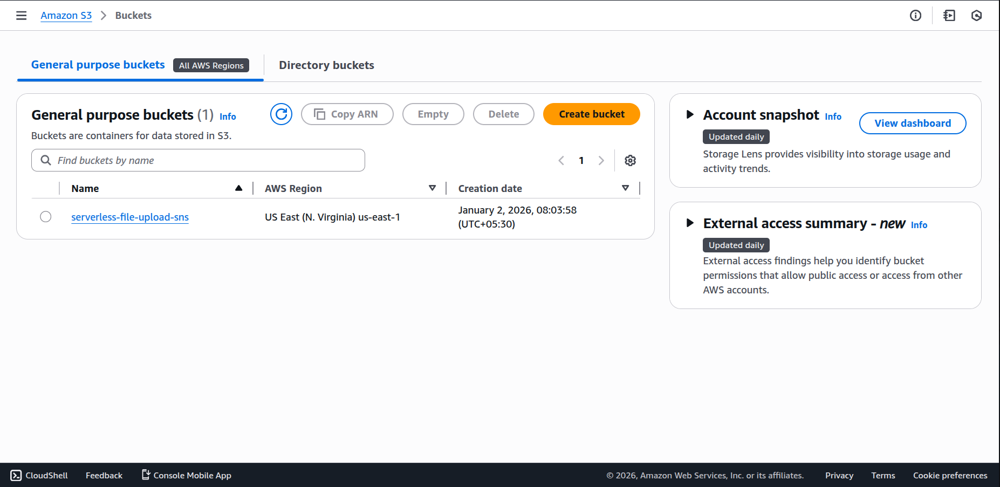

1. Open AWS S3 Console → Click Create bucket
2. Bucket name: serverless-file-upload-sns
3. Region: Choose your closest region (e.g., us-east-1)
4. Block Public Access: Leave as default (enabled)
5. Keep all other settings default
6. Click Create bucket

Verify: Your bucket should appear in the S3 dashboard.

### Step 2: Create SNS Topic

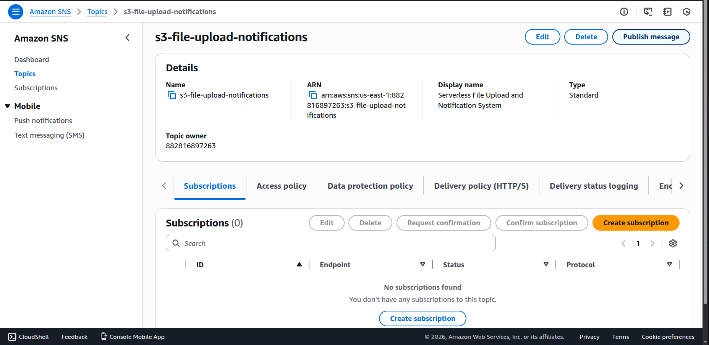

1. Navigate to AWS SNS Console
2. Click Topics (left sidebar) → Create topic
3. Type: Select Standard
4. Name: s3-file-upload-notifications
5. Leave other settings as default
6. Click Create topic

Copy the Topic ARN – You'll need this for the Lambda function.

### Step 3: Create SNS Email Subscription

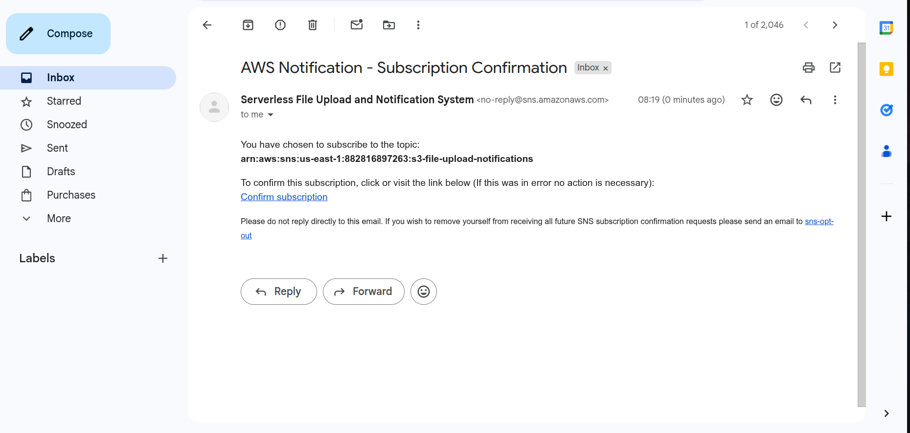

1. Go to your SNS topic → Click Create subscription
2. Protocol: Select Email
3. Endpoint: Enter your email address
4. Click Create subscription
5. Check your email inbox for a confirmation message from AWS
6. Click the confirmation link in the email

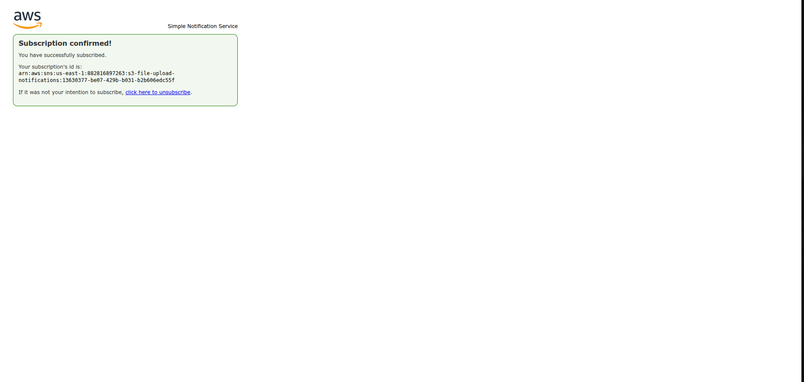

### Step 4: Create Lambda Function


1. Go to AWS Lambda Console → Create function
2. Function name: s3-file-upload-processor-fn
3. Runtime: Python 3.11 or Python 3.12
4. Execution role: Select serverless-file-upload-lambda-role (created above)
5. Click Create function

***Replace the default code with:*** 
[basic Lambda function that triggers SNS](lambda/lambda_function_JSON.py)

6. Update TOPIC_ARN: Replace with your actual SNS topic ARN from Step 2.
7. Click Deploy

### Step 5: Configure S3 Event Notification → Lambda

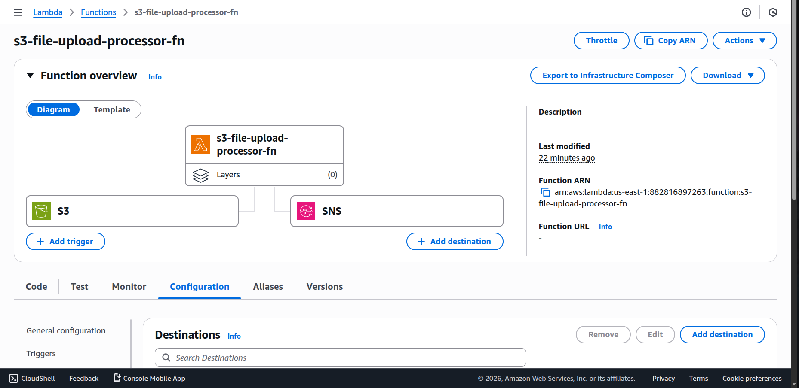

1. Go to lambda function Console
2. Click on add trigger
3. select S3 and event after that save
4. click on add destination
5. select SNS topic and Click Save

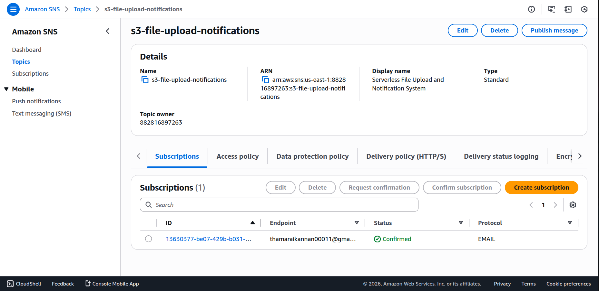

## 🧪 Testing the System

### Test 1: Upload via AWS Console

1. Go to S3 Console → Open bucket serverless-file-upload-sns
2. Click Upload → Select any file (PDF, image, document, etc.)
3. Click Upload

### Test 2: Upload via AWS CLI

```
aws s3 cp <file-name> s3://serverless-file-upload-sns/
```

### Test 3: Monitor Lambda Execution

1. Go to Lambda Console → Select s3-file-upload-processor-fn
2. Click Monitor tab → View CloudWatch logs
3. Check the latest log stream for execution details

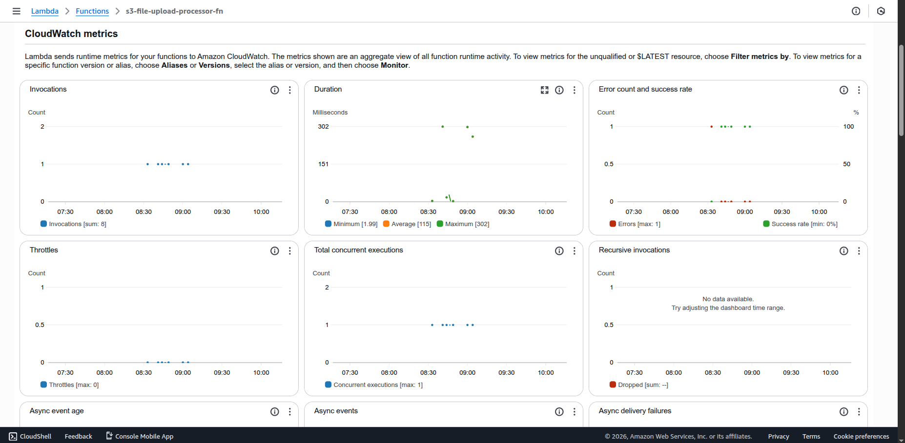

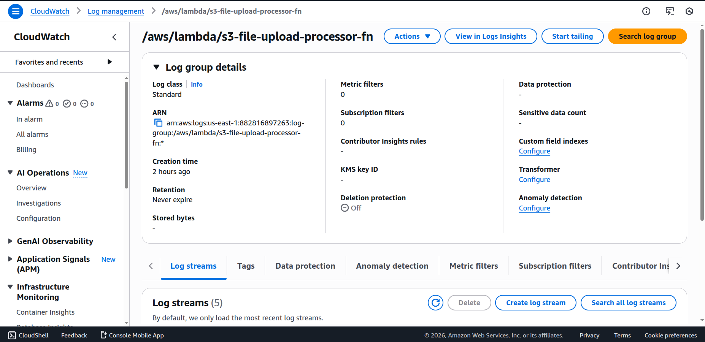

### Test 4: Check Your Email

You should receive an email like this:

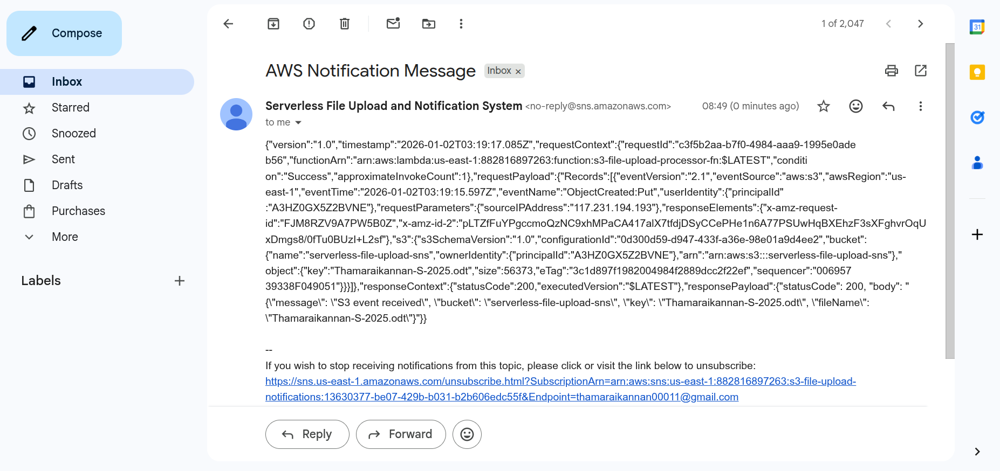

# Optional if custom response

## 🎨 Customize Email Format

1. ***Remove destination***

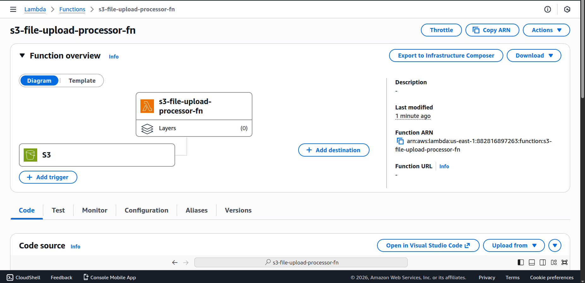

2. ***Replace the default code with formatted one:*** 
[Lambda function that format the SNS email](lambda/lambda_function.py)

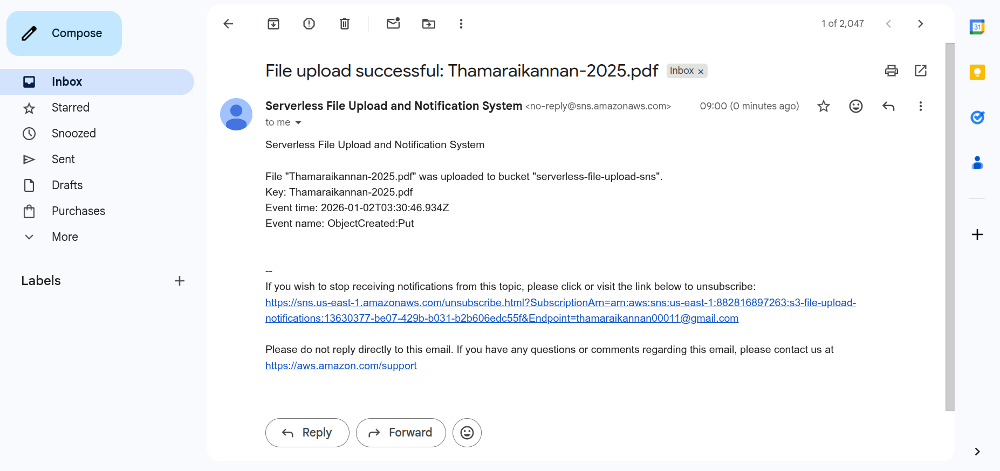

## 💰 Cost Estimation

| Service         | Usage                          | Approx. Cost (USD/month) |
| --------------- | ------------------------------ | ------------------------ |
| S3              | 1,000 uploads + 1 GB storage   | $0.05                    |
| Lambda          | 1,000 invocations, 128 MB, 1 s | $0.00                    |
| SNS             | 1,000 email notifications      | $0.50                    |
| CloudWatch Logs | ~1 MB logs                     | $0.03                    |
| Total           | –                              | ~$0.58/month             |

***Free Tier covers: Lambda (1M invocations), SNS (1,000 emails), S3 (5GB). Actual costs vary by region.***


## 📚 Useful Resources

[AWS Lambda Best Practices](https://docs.aws.amazon.com/lambda/latest/dg/best-practices.html)

[S3 Event Notifications](https://docs.aws.amazon.com/AmazonS3/latest/userguide/NotificationHowTo.html)

[SNS Topic Configuration](https://docs.aws.amazon.com/sns/latest/dg/CreateTopic.html)

[AWS Pricing Calculator](https://calculator.aws/)

[boto3 Documentation](https://boto3.amazonaws.com/v1/documentation/api/latest/index.html)

# Built with ❤️ using AWS Serverless Services 🚀